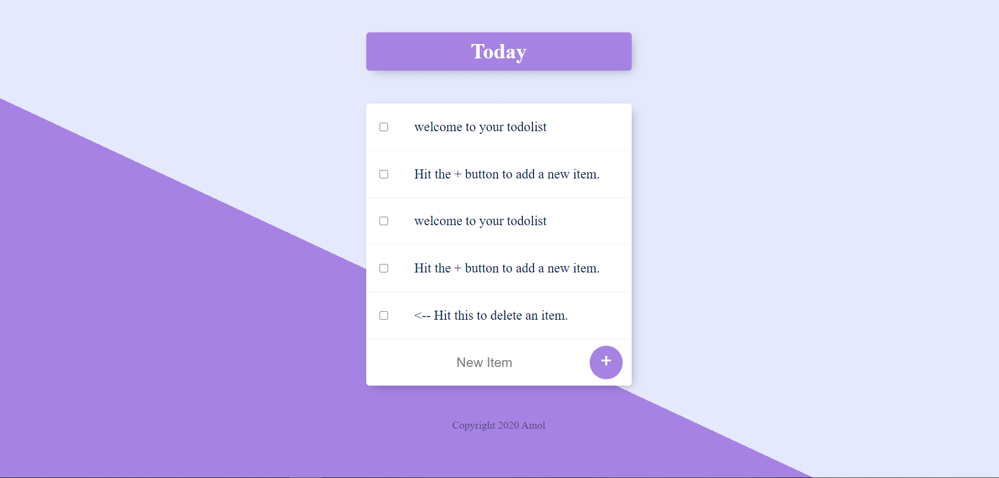
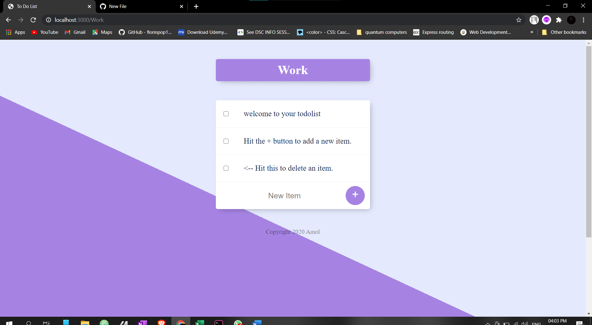

## To Do App

Objective:To Do App to create your *personal* to do list and get your work done!

### Getting Started

1.  Add your tasks to To Do List and cross them as you finish the tasks
1.  Create multiple To DO LIsts to manage your personal/professional life

### With this app

See a list of all todos Create a new todo Update an existing todo Delete an existing todo

Getting Started

1.  Fork this repo, and clone it into your develop folder on your local machine.

2.  Use this app for a more convenient life or push to add changes to contribute to this repository

### App Screenshots

